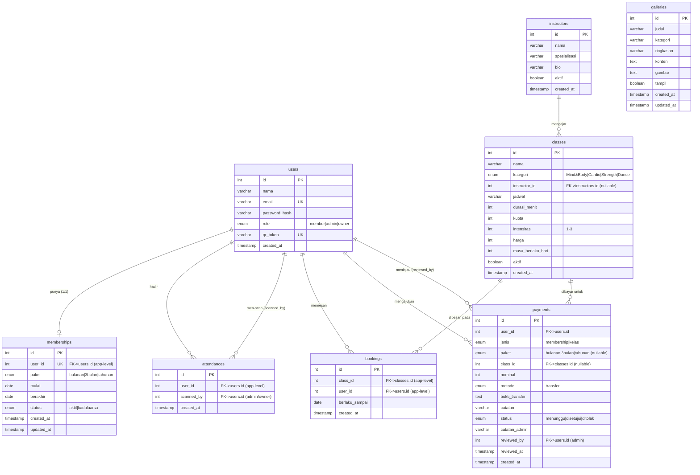

# ERD — Heyfit Fitness

Diagram Entity-Relationship untuk database Heyfit Fitness (8 tabel).
Relasi antar tabel dijaga di level aplikasi (tidak ada FK fisik di DB),
namun secara logika kardinalitasnya digambarkan di bawah.

## Catatan relasi

| Relasi | Kardinalitas | Kunci | Keterangan |
| --- | --- | --- | --- |
| users → memberships | 1 : 0..1 | `memberships.user_id` (UNIQUE) | Satu user maksimal satu baris membership. |
| users → attendances | 1 : 0..N | `attendances.user_id` | Member yang hadir (check-in). |
| users → attendances | 1 : 0..N | `attendances.scanned_by` | Admin/owner yang men-scan QR. |
| users → bookings | 1 : 0..N | `bookings.user_id` | Member yang memesan kelas. |
| classes → bookings | 1 : 0..N | `bookings.class_id` | UNIQUE(class_id, user_id) → 1 reservasi/kelas. |
| instructors → classes | 1 : 0..N | `classes.instructor_id` (nullable) | Satu instruktur mengajar banyak kelas. |
| users → payments | 1 : 0..N | `payments.user_id` | Member yang mengajukan pembayaran. |
| users → payments | 1 : 0..N | `payments.reviewed_by` | Admin yang meninjau pembayaran. |
| classes → payments | 1 : 0..N | `payments.class_id` (nullable) | Hanya untuk pembayaran `jenis='kelas'`. |
| galleries | — | — | Tabel mandiri, tanpa relasi. |

> **Catatan:** Semua relasi dijaga di level aplikasi (session-based), bukan
> foreign key fisik di TiDB/MySQL. Lihat [server/database/schema.ts](../server/database/schema.ts).
